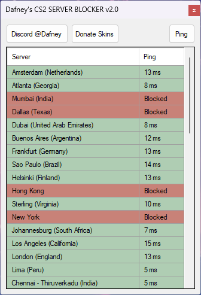

# CS2-SERVER-BLOCKER
Counter-Strike 2 Server Blocker

## Description
This Software lets you block or unblock selected CS2 servers.

## Usage
Start Software as Administrator. Click the server(s) you want to block or unblock.

## What the Software does
The Software fetch the official server list and pings them. It will modify firewall rules.

## Anti-Virus Software
This Software may cause false-positive and does not work with custom firewalls.

## License
This Software uses [SUPERB License](LICENSE.txt). 
